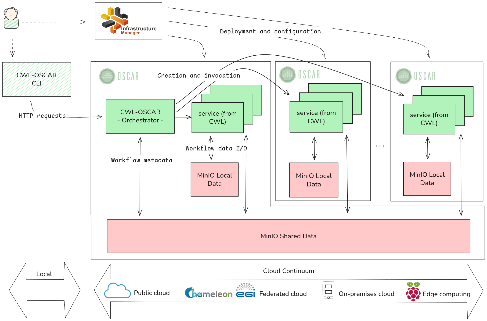

# CWL-OSCAR

[](https://pypi.org/project/cwl-oscar/)
[](https://python.org)
[](LICENSE)

**A lightweight Workflow Management System to orchestrate CWL workflows on OSCAR clusters**

CWL-OSCAR enables you to run [Common Workflow Language (CWL)](https://www.commonwl.org/) workflows on [OSCAR](https://oscar.grycap.net/) clusters, providing seamless integration between workflow orchestration and serverless computing infrastructure.

## 🚀 Quick Start

### Prerequisites

- Python 3.12+
- Access to an OSCAR cluster. 
    - How to deploy a local OSCAR cluster can be found in the [OSCAR documentation](https://docs.oscar.grycap.net/latest/local-testing/).

### Installation

```bash
pip install cwl-oscar
```

### Basic Usage

1. **Initialize the OSCAR orchestrator service:**
```bash
cwl-oscar-cli --init \
  --cluster-endpoint https://your-oscar-cluster.com \
  --cluster-token your-oidc-token
```

2. **Run a simple workflow:**
```bash
cwl-oscar-cli --workflow hello.cwl \
  --input input.json \
  --cluster-endpoint https://your-oscar-cluster.com \
  --cluster-token your-oidc-token
```

> **📝 Note:** For local OSCAR clusters, you can omit the `--cluster-endpoint` parameter (defaults to localhost):
> ```bash
> # Local cluster example
> cwl-oscar-cli --init --cluster-username YOUR_USERNAME --cluster-password YOUR_PASSWORD
> cwl-oscar-cli --cluster-username YOUR_USERNAME --cluster-password YOUR_PASSWORD hello.cwl input.json
> ```

> **⚙️ MinIO Configuration for Local Clusters:** When working with local OSCAR clusters, you may need to configure MinIO access:
> 1. **Port forwarding:** Set up port forwarding to access MinIO service
> ```bash
> kubectl port-forward -n minio service/minio 9000:9000
> ```
> 2. **Add to /etc/hosts:** Add MinIO hostname to your local hosts file
> ```bash
> echo "127.0.0.1 minio.minio" | sudo tee -a /etc/hosts
> ```

## What is CWL-OSCAR?

CWL-OSCAR is a workflow executor that bridges the gap between:
- **CWL workflows**: Industry-standard workflow descriptions
- **OSCAR clusters**: Serverless computing infrastructure for scientific workloads

### Key Features

- **Full CWL Compatibility**: Uses cwltool's core functionality for CWL parsing
- **Multi-Cluster Support**: Execute workflows across multiple OSCAR clusters  
- **Mounted Storage**: Efficient data access through shared data lakes
- **Token Authentication**: Supports OIDC token authentication
- **Local Runner**: Run workflows from local files on remote infrastructure
- **Asynchronous Execution**: Non-blocking workflow execution with remote monitoring

## Usage Examples

### Example 1: Hello World Workflow

Create a simple CWL tool (`hello.cwl`):
```yaml
#!/usr/bin/env cwl-runner
cwlVersion: v1.0
class: CommandLineTool

baseCommand: echo
inputs:
  message:
    type: string
    inputBinding:
      position: 1
outputs:
  output:
    type: stdout
stdout: hello.txt
```

Input file (`input_hello.json`):
```json
{
  "message": "Hello, CWL-OSCAR!"
}
```

Run the workflow:
```bash
cwl-oscar-cli  --cluster-endpoint https://your-oscar.com \
  --cluster-username YOUR_USERNAME --cluster-password YOUR_PASSWORD \
  hello.cwl input_hello.json
```

### Example 2: Complex Bioinformatics Workflow

CWL-OSCAR includes a complete malaria drug resistance analysis workflow that demonstrates advanced features:

```bash
cd cwl_oscar/example/malaria-cwl-portable-package/workflows
cwl-oscar-cli   --cluster-endpoint https://your-oscar.com \
--cluster-token YOUR_TOKEN \
malaria-with-reports-clean.cwl \
../examples/portable-test-input.yml
```

This workflow:
- Processes multiple samples in parallel
- Uses DADA2 for haplotype reconstruction  
- Generates comprehensive final reports
- Creates publication-ready outputs

## Architecture

CWL-OSCAR consists of two main components:

1. **CWL-OSCAR CLI** (`cwl-oscar-cli`): Local command-line interface
2. **OSCAR Orchestrator Service**: Remote execution engine running on OSCAR



## Configuration

### Service Configuration

The orchestrator service is automatically configured with:
- **Memory**: 500Mi
- **CPU**: 0.5 cores
- **Storage**: Automatic MinIO buckets for input/output/mount
- **Name**: `cwl-oscar` (customizable with `--service-name`)

## Testing

The project includes comprehensive examples for testing:

### Simple Examples
```bash
cd cwl_oscar/example
ls *.cwl  # hello.cwl, date.cwl, whoami.cwl, etc.
```

### Advanced Bioinformatics Workflow
```bash
cd cwl_oscar/example/malaria-cwl-portable-package
# Contains complete malaria drug resistance analysis pipeline
```

### Running Tests Locally

```bash
# Install in development mode
pip install -e .

# Run basic tests
python -m pytest cwl_oscar/test_oscar.py

# Test with local workflows
cwl-oscar-cli  --cluster-endpoint https://your-oscar.com \
  --cluster-username YOUR_USERNAME --cluster-password YOUR_PASSWORD \
  hello.cwl input_hello.json
```

## Requirements

### Core Dependencies
- `cwltool>=3.1.20250715140722` - CWL reference implementation
- `oscar-python>=1.3.1` - OSCAR API client
- `minio>=7.2.0` - Object storage client
- `pydantic>=2.0.0` - Data validation

### Development Dependencies
- `cwltest>=2.6.20250314152537` - CWL conformance testing

## Troubleshooting

### Common Issues

1. **Authentication Errors**: Ensure your OSCAR token is valid and has appropriate permissions
2. **Workflow Failures**: Check that Docker images specified in CWL are accessible
3. **Storage Issues**: Verify MinIO bucket permissions and network connectivity

### Debug Mode

```bash
cwl-oscar-cli --debug --cluster-username <user> --cluster-password <password> your-workflow.cwl your-input.json
```

## License

This project is licensed under the Apache License 2.0 - see the [LICENSE](LICENSE) file for details.

## Acknowledgments

- [Common Workflow Language](https://www.commonwl.org/) community
- [OSCAR](https://oscar.grycap.net/) development team
- [cwltool](https://github.com/common-workflow-language/cwltool) maintainers

## Support

- **Issues**: [GitHub Issues](https://github.com/grycap/cwl-oscar/issues)
- **OSCAR Community**: [OSCAR Documentation](https://docs.oscar.grycap.net/)
